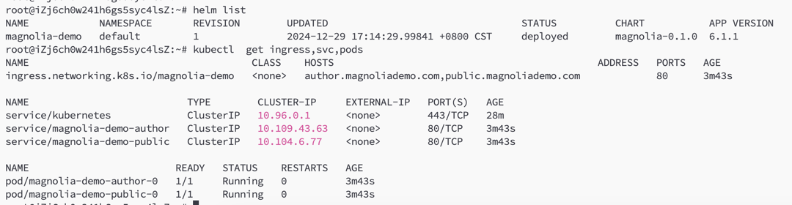

# Demo

This is a demo for deploy Magnolia CMS by helm chart in k8s installed by minikube.

# minikube
1. Start k8s as below screenshot, for connect the cluster locally and CICD purpose, we set `--listen-address=0.0.0.0`, but for security reasones, we`d better to **configure a security group or firewall rules**.
  
2. Check port mappin of api server of 8443  
```
docker port minikube
22/tcp -> 0.0.0.0:32768
2376/tcp -> 0.0.0.0:32769
5000/tcp -> 0.0.0.0:32770
8443/tcp -> 0.0.0.0:32771
32443/tcp -> 0.0.0.0:32772
```

Creates a webapp and docker container for Magnolia CMS using `io.fabric8:docker-maven-plugin`. It inherits from ```magnolia-empty-webapp``` 
and relies on as little customizations as possible.

### Run the container

Pull and run the container:
`docker pull ghcr.io/magnolia-sre/magnolia-docker/magnolia-docker:latest`

See: 
[magnolia-sre/magnolia-docker Packages](https://github.com/orgs/magnolia-sre/packages/container/package/magnolia-docker%2Fmagnolia-docker)

Default login username and password: superuser/superuser

It should be noted that Docker is no longer officially supported.

## CI/CD

Refer to the [pipeline](.github/workflows/pipeline.yml) for more insights.

## Simplifications

* Uses H2 DB
* No persistent storage
* ..
